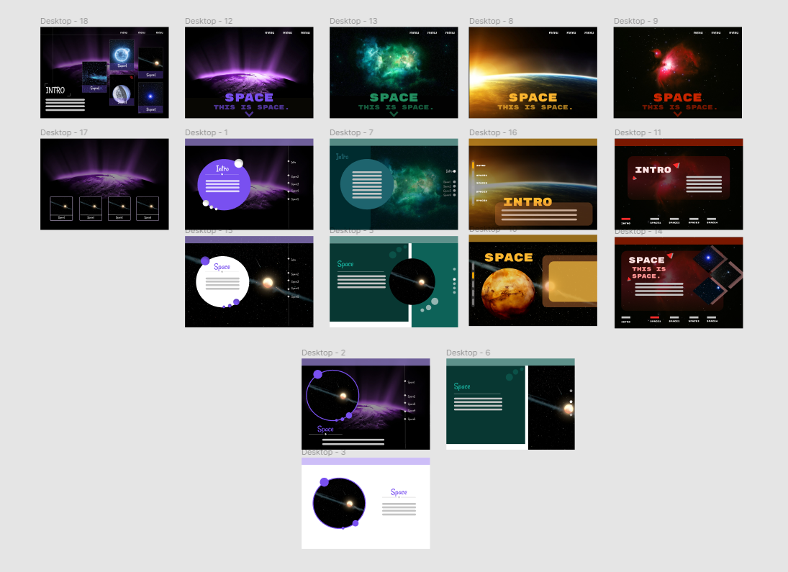
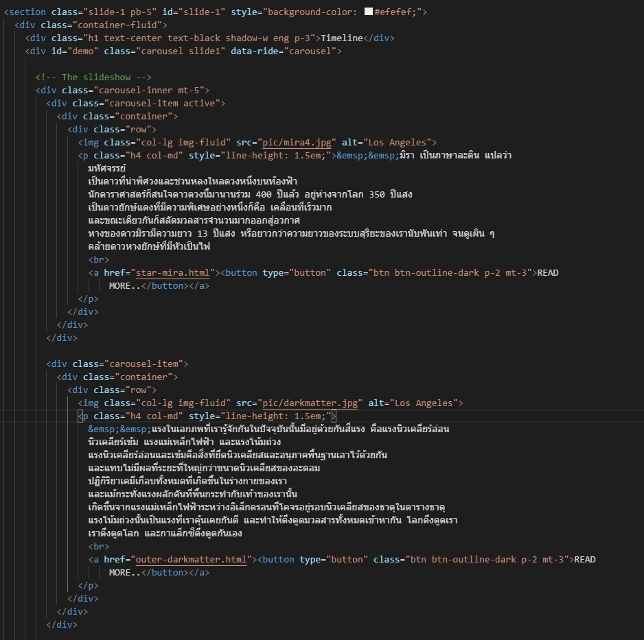
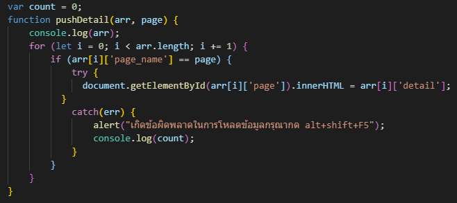
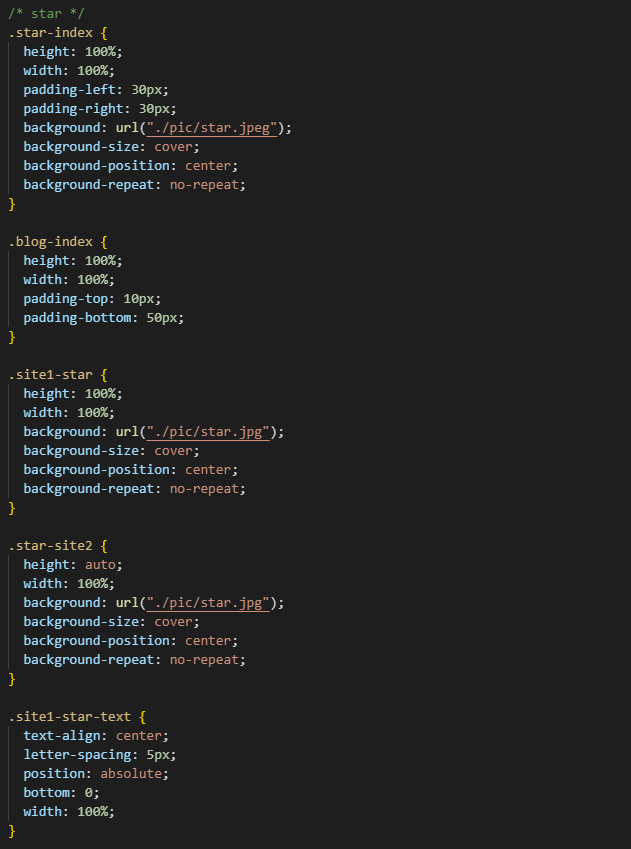
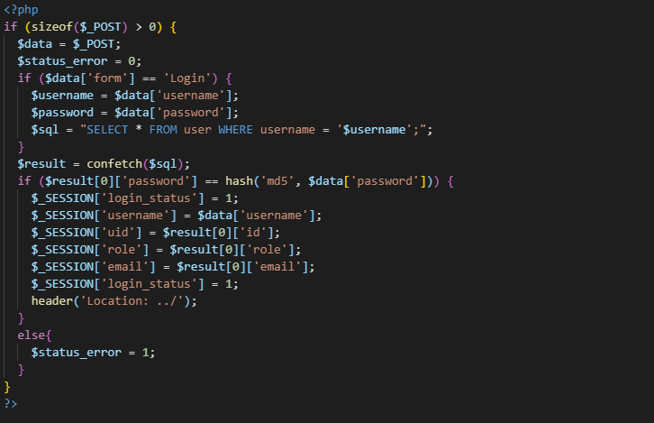
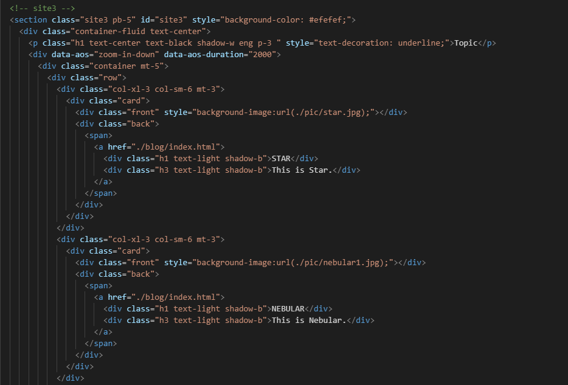
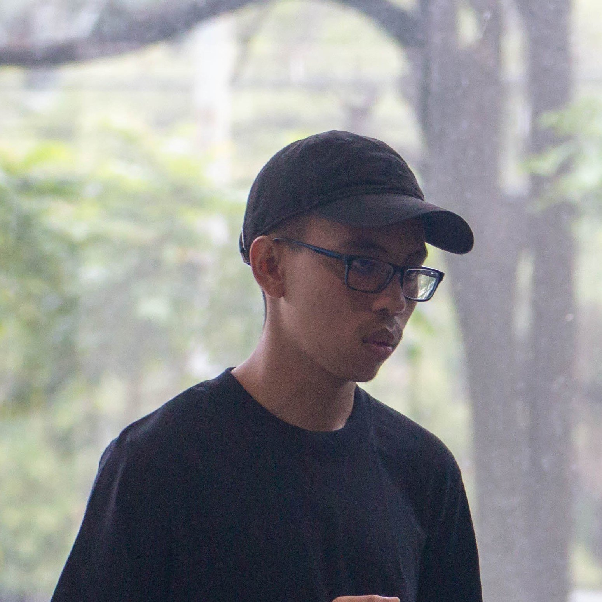
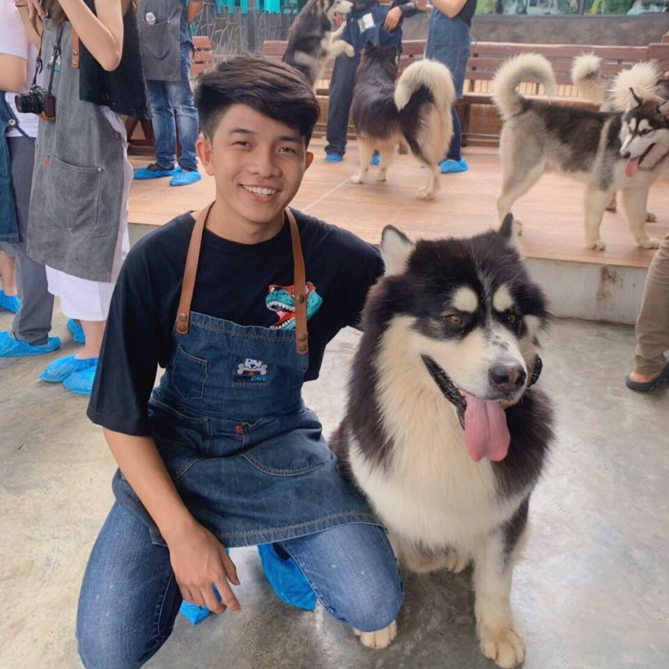

# **MYSTERYEARTH**
## Project Web Technology IT KMITL
* ### วัตถุประสงค์ 
  * ##### เพื่อให้ความรู้แก่ผู้ที่สนใจในหัวข้อ เรื่องแปลกในจักวาล
  * ##### เพื่อเสริมสร้างความรู้ให้นักเรียนมัธยมปลาย ที่มีความสนใจในเรื่อง โลก ดาราศาสตร์ และจักรวาล ได้มา ศึกษาเพิ่มเติม
  * ##### เพื่อรวบรวมความรู้ สร้างความสะดวกในการเรียนรู้ให้กับผู้ที่สนใจ

* ### เทคโนโลยีที่นำมาใช้ในการทำโครงงาน
  * ##### FIGMA (ใช้เว็บไซต์ figma ในขั้นตอนการออกแบบกำหนดโครงสร้างของเว็บไซต์ในแต่ละหน้า)
  

  * ##### HTML (ใช้ HTML ในการกำหนดโครงสร้างของหน้าเว็บไซต์ในแต่ละหน้า)
  

  
  * ##### JavaScript (ใช้ JavaScript ในการแสดงผลข้อมูลส่วนใหญ่ ซึ่งดึงมาจาก Database อีกที)
  

  * ##### CSS (ใช้ CSS ในการตกแต่งเว็บไซต์ให้สวยงาม เช่น การกำหนดลักษณะตัวอักษร สี พื้นหลัง)
  

  * #####  PHP (ใช้ php ในการเชื่อมต่อกับฐานข้อมูล ใช้เป็นระบบ register / login ด้วย username กับ password)
  

  * ##### BOOTSTRAP (ใช้ในการตกแต่ง CSS style ในเว็บ Responsive รองรับทุก Platform)
  

* ### สมาชิก
  
  | **ขื่อ**  | **นามสกุล**  | **รหัสนักศึกษา**  | **PROFILE**  |
  | ----- | ----- | ----- | ----- |
  | **จักรพรรดิ์** | **สุวรรณโณ** | **61070022** | 

 |
  | **ปารเมศ** | **คงเจริญ** | **61070121** | 

 |
  | **ราโมน่า** | **บราว** | **61070189** | 

 |
  | **สุกฤษฎิ์** | **ลีลากรกิจ** | **61070245** | 

 |
  | **สุชานนท์** | **วิโรจน์รัตน** | **61070246** | 

 |
